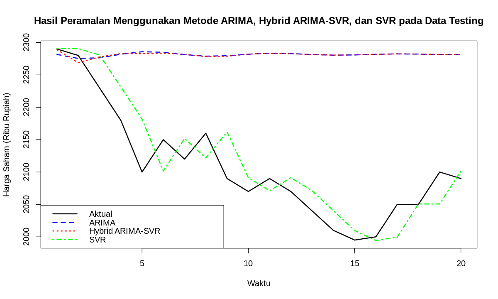

# MYOR Stock Price Forecasting

A comparative analysis of ARIMA, Hybrid ARIMA-SVR, and SVR models for forecasting PT Mayora Indah Tbk (MYOR) stock prices.

## Project Overview

This project aims to compare the forecasting performance of ARIMA, Hybrid ARIMA-SVR, and Support Vector Regression (SVR) models in predicting MYOR stock prices. The models are evaluated to identify the most accurate approach for stock price forecasting.

## Tools & Technologies

- Python
- Pandas
- NumPy
- Scikit-Learn
- Statsmodels
- Matplotlib

## Key Findings

- Hybrid ARIMA-SVR achieved the highest forecasting accuracy among the evaluated models.
- ARIMA effectively captured linear trends but was less effective in modeling nonlinear patterns.
- Combining ARIMA and SVR improved prediction performance compared to individual models.

### Model Comparison

## Note

This project was completed as part of a group academic project.
